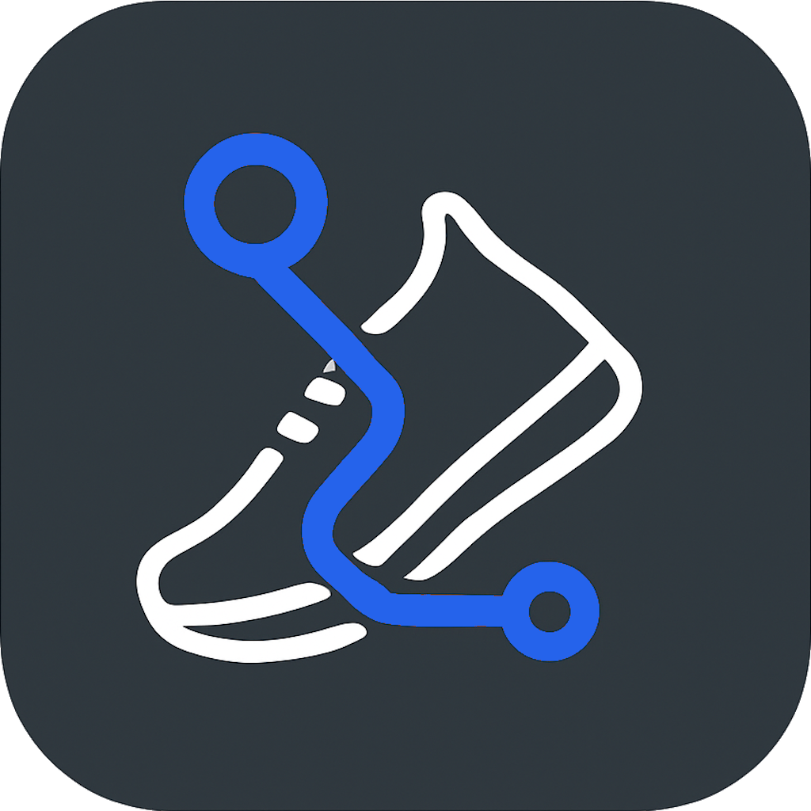
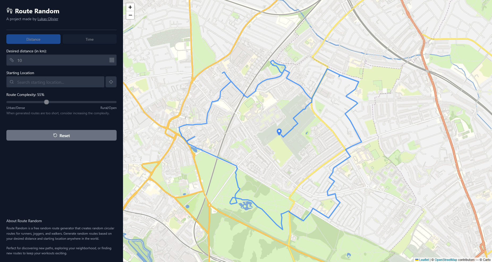

#  Route Random

  
  
  
  
  
  

> **Discover new routes, anywhere.**

Route Random is a modern web application built with **React** and **Next.js** that serves as your personal route generator. Instantly create unique, circular routes for walking, running, or cycling tailored to your distance and location. Whether you're training for a marathon, exploring a new city, or just want to shake up your daily routine, Route Random helps you find the perfect path.

## 🚀 Features

- **Smart Route Generation**: Get random, circular routes that start and end at your chosen point.
- **Flexible Distance**: Set your desired distance—Route Random adapts the route for you.
- **Location Search & Map Click**: Find your start by address or simply click on the map.
- **Live Location Tracking**: Real-time GPS tracking with high accuracy positioning (mobile optimized).
- **Export to GPX & GeoJSON**: Download routes for Garmin, Strava, or any fitness app.
- **Privacy First**: No accounts, no tracking, no nonsense.
- **Modern Tech Stack**: Built with React, Next.js, and TypeScript for optimal performance and developer experience.

## 🛠️ Technical

This application showcases modern web development practices using:

- **Frontend**: React with Next.js
- **Styling**: Tailwind CSS for responsive, utility-first design
- **Maps**: Leaflet.js for interactive mapping functionality
- **Geolocation**: Browser Geolocation API with watchPosition for continuous location updates
- **Language**: TypeScript for type safety and better developer experience
- **API Integration**: OpenRouteService for route calculation and geocoding

## 🌍 Powered By

This project would not be possible without these amazing open-source projects and services:

- [OpenStreetMap](https://www.openstreetmap.org/) – Free, editable map of the world
- [Leaflet](https://leafletjs.com/) – Open-source JavaScript library for interactive maps
- [OpenRouteService](https://openrouteservice.org/) – Routing and geospatial API services

  Made by <a href="https://www.lukasolivier.be" target="_blank">Lukas Olivier</a>

